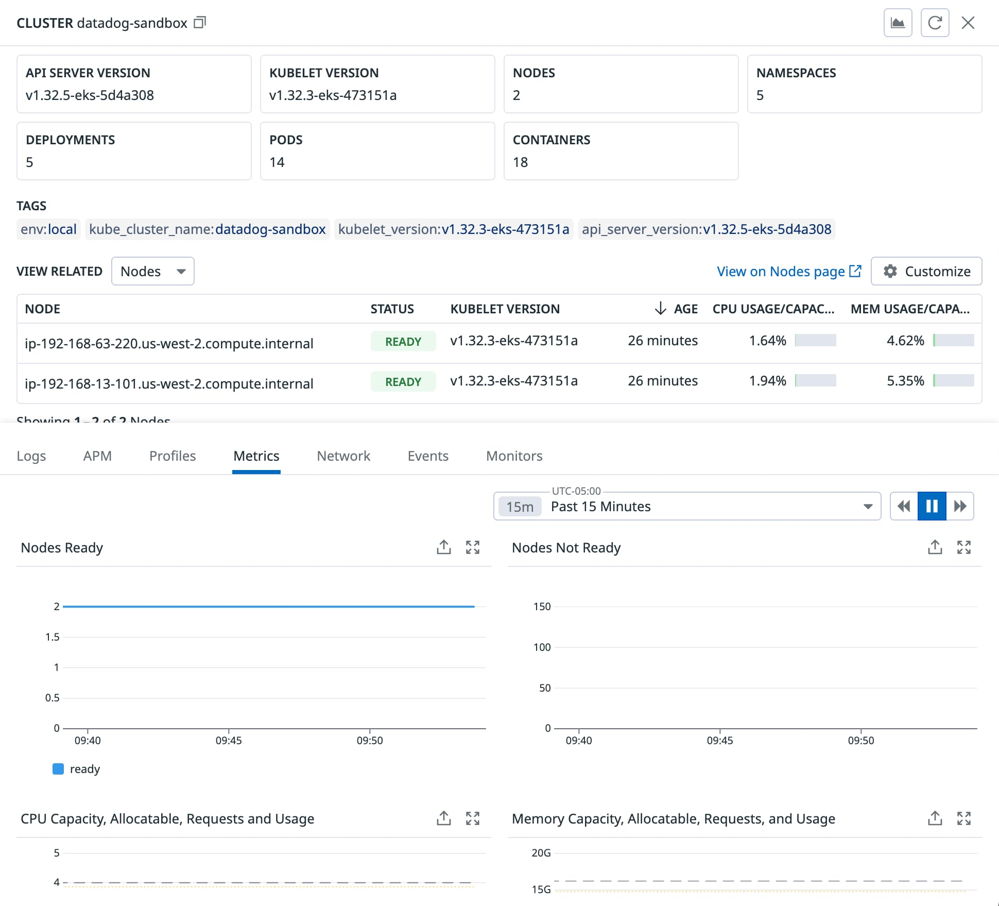

Over the past few years I've spent a great deal of time writing
and [building with Datadog](https://binaryheap.com/tag/datadog/). I find that their platform gives me as a builder the
right insight and tools to diagnose things quickly, make adjustments when things
run out of resources, and observe my software's behavior in test and at scale. During this past year or two, I've
been expanding my skills into the Kubernetes ecosystem and was so pleased to find that my Datadog experience is valuable
there as well. So, from Serverless to Kubernetes, Datadog has me covered. Let's explore what establishing Datadog
on Kubernetes means for me as a developer.

## Datadog on Kubernetes

Let's start out by exploring what the ecosystem looks like when deploying Datadog on Kubernetes. The image below is
from a wonderful article on the Datadog blog which shows that there are two agents I will be running.

* Node Agent -- handles node level APM and metrics collection
* Cluster Agent -- runs on a Node and deals with aggregating data from the various nodes to ship to the Datadog
  platform


> Credit to Datadog on the above
> image [from this blog article](https://www.datadoghq.com/blog/monitoring-kubernetes-with-datadog/)

For the balance of this article, I'm going to explore how to make this a reality on a fresh Kubernetes cluster
hosted on AWS' EKS (Elastic Kubernetes Service)

## Working through the Project

If you want to follow along, the repository backing this article can be found
at [this link to GitHub](https://github.com/benbpyle/eks-datadog-initial)

### Creating the Cluster

To get the cluster up and running, I've created an `eksctl` configuration that will help with that.

```yaml
---
apiVersion: eksctl.io/v1alpha5
kind: ClusterConfig

metadata:
  name: sandbox
  region: us-west-2

managedNodeGroups:
  - name: mng-arm
    instanceType: m6g.large
    desiredCapacity: 2
```

This file sets up an EKS cluster running 2 nodes running AWS' Graviton processors. I just like running Graviton
over x86. Better, cheaper, faster, and all of that. These nodes and the cluster are in us-west-2. Basic setup.

```bash
eksctl create cluster -f cluster/cluster-config.yaml
```

Give this a little bit of time to run. There's a CloudFormation stack that'll be generated and execute in your AWS
account. Once finished, updated your kubectl and check the status of the nodes.

```bash
aws eks update-kubeconfig --name sandbox --region us-west-2
kubectl get nodes
```

### Installing Datadog

There are a couple of ways to install Datadog into a Kubernetes cluster. The approach I like to take is to use [Helm]
(https://helm.sh/). With Helm, I can keep all of my values for the Datadog agents in the proper area and update my
releases as needed. I find the Helm values file looks pretty close to an agent configuration file.

### Configure Datadog Secret

The agent can access the secrets store for things like the API Key which needs to stay private. My first order for
configuration is to get the secret loaded up.

```bash
kubectl create secret generic datadog-secret --from-literal api-key=<YOUR_DATADOG_API_KEY>
```

### Working with Helm

Installing Datadog with Helm is quite easy. I need to add the repository that Datadog is stored in and then run the
installation. I can also verify that everything looks good.

```yaml
helm repo add datadog https://helm.datadoghq.com
helm repo update

helm install datadog-agent -f datadog/datadog-values.yaml datadog/datadog

kubectl get pods -l app.kubernetes.io/name=datadog
```

### Deploying Applications

As a part of this walkthrough, I'm going to deploy a couple of services so that I can show how Datadog blends
Kubernetes with APM (Application Performance Monitoring) so easily. And of course, I'm going to use some code
written in Rust, packaged with Docker, and hosted in AWS ECR (Elastic Container Registry). For this sample, I'll
have "service-a" and "service-b". I'll make requests to "service-b" which will call "service-a" and those traces
will be emitted via OpenTelemetry and shipped to Datadog via the node and cluster agent.

```yaml
# create the namespace first
kubectl apply -f namespaces/rust-services-namespace.yaml
kubectl get namespaces
```

Time to install the services.

```yaml
kubectl apply -f services/service-a.yaml
kubectl apply -f services/service-b.yaml
```

Before moving on to showing what this all produces, I need to point out how I'm connecting the services to Datadog
via the node agent. This is a snippet from the service definition.

```yaml
  env:
    # this allows me to get the Agent Address which the OTEL tracer must have
    - name: HOST_IP
      valueFrom:
        fieldRef:
          fieldPath: status.hostIP
    - name: BIND_ADDRESS
      value: "0.0.0.0:3000"
    - name: DD_TRACING_ENABLED
      value: "true"
    # notice that I'm using HOST_IP defined above
    - name: AGENT_ADDRESS
      value: $(HOST_IP)
    - name: RUST_LOG
      value: "info"
    - name: SERVICE_A_URL
      value: http://service-a
```

## Putting the Pieces Together

I find that the more I consume from the Datadog ecosystem the more value I find. I've done so much with Serverless,
logs, APM, and databases, but being able to bring it all together to observe my infrastructure as well is just so
powerful. I'm going to make a quick tour (as this is an introduction) through some of the parts I like and use the
most. This isn't exhaustive, but it should be enough to get you going.

### Cluster(s) Overview

This initial view is just a nice overview of the cluster(s) that I'm managing. I can jump into specifics by clicking
on any one of those tiles, but on the surface it's just a great top-level visual. You can see at this point, I've
just got the one cluster, and the other tiles are representing the items/resources we've deployed together in this
article.


Once I drill into any of those, the navigation options open up tremendously. All of these options can be scoped by
any tag that I've create, labels defined in Kubernetes, or the DD_ENV (Datadog environment) that I've scoped my
resources down to.


### Nodes, Deployments, Containers, and Processes

Diving deeper, I can drill as far down the rabbit hole as I'd like. Starting out with nodes, I can see all of my nodes
in whatever state they are in, including all the various elements that make them unique. IP address, chip
architecture, and so on and so forth.



Diving further, my Deployments are also exposed via Datadog. If I have two nodes running, I've got some number of pods
using the resources I have deployed up to this point. I could further view these by pod or if I'd deployed as
ReplicaSets or StatefulSets, they'd be exposed that way too.


The last level of depth is the actual process itself. I find this pretty fascinating as I can explore the physical
process and the user that's running the process. Datadog gives me that which I find incredibly powerful.


### Traces

As a long time Datadog user, traces are where I've spent most of my time. Traces in containers. Traces in Lambda
Functions. Traces between Functions and Containers. What I really enjoy is that I can see the traces on the
individual node, deployment, container, or process just like I showed up above. I don't need to visit the specific
APM section of the Datadog UI, it's just right there for me to access.


## Wrapping Up

From this point, there are so many places to jump off and explore, but you should have a working Kubernetes cluster
running on EKS with Datadog correctly installed. If at this point, you've gone as far as you want, and choose to
cleanup your resources, here's how you delete the cluster.

```bash
eksctl delete cluster -f cluster/cluster-config.yaml
```

However, should you want to continue, I encourage you to explore this expansive documentation
at [Datadog](https://docs.datadoghq.com/containers/kubernetes/) in relation to Kubernetes. There's so much to dive into
and
stay tuned, as I'll have more walkthroughs and opinions in the future as well.

At the beginning of this article, I linked out to the GitHub repository. In case you missed
it, [here it is again](https://github.com/benbpyle/eks-datadog-initial). I encourage you to run through this in your own
environment as
it'll help the information stick.

My wrap-up thoughts on all of this can simply be summed up as this. Do not build distributed and cloud native
software without a solid plan for observability. It is not a smart strategy to try and "add as you go". Do it
right from the start and you won't regret it. And when it comes to tooling around observability, Datadog is the top
of the stack. Use it. Learn it. And you won't regret it.

Thanks for reading and happy building!
